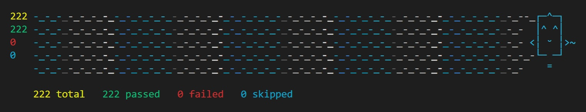

karma-happit-reporter
===================

[Happit](https://happit.com) style reporter for karma, forked from [karma-nyan-reporter](https://github.com/dgarlitt/karma-nyan-reporter)




Installation
========

Installation is simple using npm, just run the following command:

```sh
npm install --save-dev karma-happit-reporter
```

Since this follows Karma's plugin naming convention, that's all there is to it!

Now, run your tests and enjoy:

```sh
karma start path/to/karma.conf.js --reporters happit
```

Error and Logging Output
=========

Here is a screenshot of the error and logging output. The errors are displayed hierarchically based on the test suite and nesting level. ```console.log()``` messages are output at the bottom (in blue) below the test summary and grouped by browser.


Options
=========

If you want to suppress the stack trace at the end of the test run you can use the suppressErrorReport option.

```js
// karma.conf.js
module.exports = function(config) {
  config.set({
    // normal config stuffs

    reporters: ['happit'],

    // reporter options
    happitReporter: {
      // suppress the error report at the end of the test run
      suppressErrorReport: true, // default is false

      // suppress the red background on errors in the error
      // report at the end of the test run
      suppressErrorHighlighting: true, // default is false

      // increase the number of rainbow lines displayed
      // enforced min = 4, enforced max = terminal height - 1
      numberOfRainbowLines: 100, // default is 4

      // only render the graphic after all tests have finished.
      // This is ideal for using this reporter in a continuous
      // integration environment.
      renderOnRunCompleteOnly: true // default is false
    }
  });
};
```
